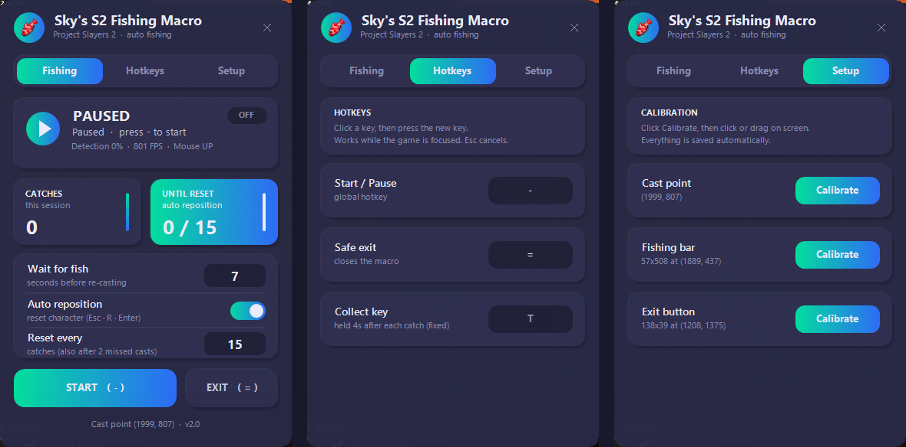

# Sky's S2 Fishing Macro

An auto-fishing macro for **Project Slayers 2** (Roblox) on Windows 10/11. It casts, plays the
reel minigame, collects the catch and repeats. It works by reading pixels in regions you calibrate
on your own screen, so it runs at any resolution.



> Some games forbid macros. Use this at your own risk: your account could be penalised.

## Features

- **Full cycle:** cast → wait for a bite → play the minigame → collect (hold **T**) → repeat.
- **Minigame control:** tracks the green zone (including its yellow "warning" state) and the
  white block, using short holds and releases to keep the block in the zone.
- **Auto reposition (set respawn):** resets your character (Esc → R → Enter) every *N* catches
  (default 10), and after 2 missed casts in a row, so you stay on the same spot.
- **Item check:** after holding **T** the macro looks for the game's item message (for example
  "Clown Fish x1", in any colour or icon). Without a message it holds T again, up to 2 more times.
  Only a seen message counts as a catch; otherwise it counts as *no item* (the pickup failed, or the game gave nothing - the two look the same on screen). The Fishing tab
  shows catches, no-item count and the success rate. Calibrate the **Collect message** box in the
  Setup tab. Without it, every collect counts as a catch.
- **Rarity counter:** each collected item is sorted by the colour of its message banner:
  **Mythic** (red), **Legendary** (gold), **Rare** (blue) or **Common** (grey). The counts show
  on the Fishing tab.
- **ORE counter:** Ore is a Mythic with a very short name. A Mythic whose name is at most ~46 px
  wide at 1440p (scaled for other resolutions) counts as **ORE**. "Ore" is 36 px; the shortest
  other item is 56 px.
- **Auto bait buy (Auto Bait tab):** clicks the 7 shop buttons in order (Fish head bait → Max →
  Buy the selection → Dialogue → Deal → Dialogue 2 → Buy more). One round buys 99 bait, and it
  repeats until the chosen amount is bought (type an amount or pick 99 / 198 / 495 / 990 / 1980).
  Each click point is set with its own **Set** button, and the delay between clicks can be changed.
  A **wen calculator** shows what the purchase costs (1 bait = 9 wen), and a **timer** shows how
  long it will take (while buying: the time left, based on the measured pace).
  It has its own global start/stop hotkey (default F3, changeable in the Hotkeys tab). Fishing
  pauses while it is buying.
- **Equip on start:** every time you press Start it quickly taps the *correction key* (default
  `1`) and then the *rod key* (default `5`). You can change both in the **Hotkeys** tab.
- **Collect delay / Hold T time:** choose how long to wait after the minigame before holding **T**,
  and how long T is held (both default 4 s). These settings are on the **Settings** tab.
- **Minimize:** use the `–` button in the header. The macro keeps running, and you can bring it
  back from the taskbar.
- **Minigame log (Setup tab):** writes one CSV per minigame to `logs\` (zone, block, velocities,
  control output, time in zone) for tuning. Off by default.
- **Safe focus handling:** clicks and keys are only sent when the Roblox window is really in
  front, so nothing gets typed into other windows.
- **Settings are saved** to `SkysS2FishingMacro.ini` next to the exe (hotkeys, wait time,
  auto-reposition and calibration).

## Setup

1. Build it (see below) or use a `SkysS2FishingMacro.exe` you built yourself.
2. Open Roblox and stand where you want to fish.
3. In the **Setup** tab, calibrate:
   - **Cast point:** click where you want to cast.
   - **Fishing bar:** drag a tight box around the vertical minigame bar.
   - **Exit button:** drag a box around the red *Exit* button that shows during the minigame.
   - **Collect message:** drag a box around where the "<item> x1" message appears after collecting
     (next to your character).
4. Press **Start** (default hotkey `-`). The default exit hotkey is `=`. You can change both in
   the **Hotkeys** tab.

**Tip:** set *Wait for fish* high enough (for example 30–60 s). If no bite comes within that
time, the macro reels in and casts again.

## Building

You need MinGW-w64 (`winget install -e --id BrechtSanders.WinLibs.POSIX.UCRT`) or Visual Studio.
Then run:

```
build.bat
```

This produces `SkysS2FishingMacro.exe`. It is a single file with no dependencies.

## Credits

Based on the *Fishing Hyper Tracker* macro by midnytejay. This version was rebranded and
redesigned, with detection fixes, auto reposition and safer window focus handling.
